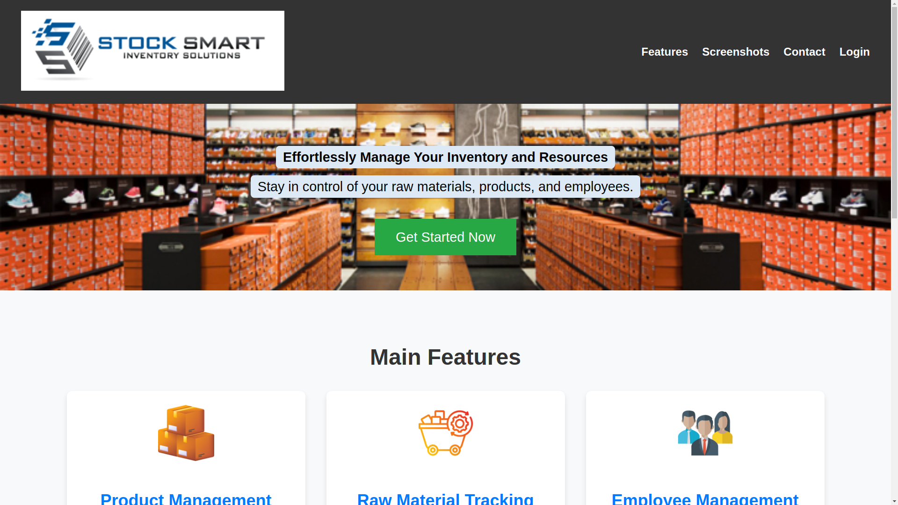

# ResourceGuard

Empowering efficiency and precision in manufacturing resource management.



## Project Overview

ResourceGuard is a comprehensive web application designed to streamline resource management within the manufacturing industry. This application focuses on managing raw materials, products, and human resources, addressing challenges such as inventory tracking, employee management, and production monitoring.

## Key Features

- **Employee Management**: Create profiles, track attendance, and calculate payroll
- **Raw Material Management**: Track suppliers, inventory, and purchase orders
- **Product Management**: Manage product catalog and monitor production processes
- **Inventory Control**: Real-time tracking of stock levels with automatic alerts
- **Dynamic Dashboard**: Interactive interface with real-time data visualization

## Technology Stack

### Backend

- **Framework**: Flask (Python)
- **Database**: MySQL
- **API**: RESTful endpoints
- **Authentication**: Session-based

### Frontend

- **Core**: HTML5, CSS3, JavaScript
- **Dynamic Content**: jQuery, AJAX
- **UI Framework**: Bootstrap (optional)

### Infrastructure

- **Version Control**: Git
- **Deployment**: ALX environment

## Project Structure

```

resource_gaurd/
├── api/ # API endpoints (employees, products, materials)
│ └── v1/ # Versioned API endpoints
├── models/ # Database models and ORM definitions
├── tests/ # Unit and integration tests
├── web_dynamic/ # Dynamic frontend components (AJAX, jQuery)
├── web_flask/ # Flask views and templates
├── web_static/ # Static assets (CSS, JS, images)
│ ├── css/
│ ├── js/
│ └── images/
├── requirements.txt # Python dependencies
├── run.sh # Application launcher
└── setup_mysql_rs.sql # Database setup script
└── insert_dummy_data.py # New dummy data insertion script

```

## Installation Guide

### Prerequisites

- Python 3.8+
- MySQL 5.7+
- Git

### Setup Instructions

1. **Clone the repository**:

   ```bash
   git clone https://github.com/solomonferede1/resource_gaurd.git
   cd resource_gaurd
   ```

2. **Set up virtual environment**:

   ```bash
   python3 -m venv venv
   source venv/bin/activate
   ```

3. **Install dependencies**:

   ```bash
   pip install -r requirements.txt
   ```

4. **Database configuration**:

   ```bash
   mysql -u root -p < setup_mysql_rs.sql
   ```

5. **Insert dummy data**:
   ```bash
   python3 insert_dummy_data.py
   ```

## Running the Application

Configure environment variables and start the app:

``bash
./run.sh```

## Access the application in your browser:

- API: http://localhost:5000

- Web UI: http://localhost:5050

## Usage Guide

1. **Access the Dashboard**:

   - Login with admin credentials (default: admin@resourceguard.com / admin123)

2. **Manage Resources**:

   - Navigate through tabs for Employees, Materials, and Products
   - Use search and filter options to find specific records

3. **Generate Reports**:
   - Export inventory reports in CSV format
   - View production analytics charts

## Contributing

We welcome contributions! Please follow these steps:

1. Fork the repository
2. Create your feature branch (`git checkout -b feature/AmazingFeature`)
3. Commit your changes (`git commit -m 'Add some AmazingFeature'`)
4. Push to the branch (`git push origin feature/AmazingFeature`)
5. Open a Pull Request

## Contact

For support or questions, please contact:

- Solomon Ferede - ezezsolomonferede@gmail.com
- Project Link: [https://github.com/solomonferede1/resource_gaurd](https://github.com/solomonferede1/resource_gaurd)
